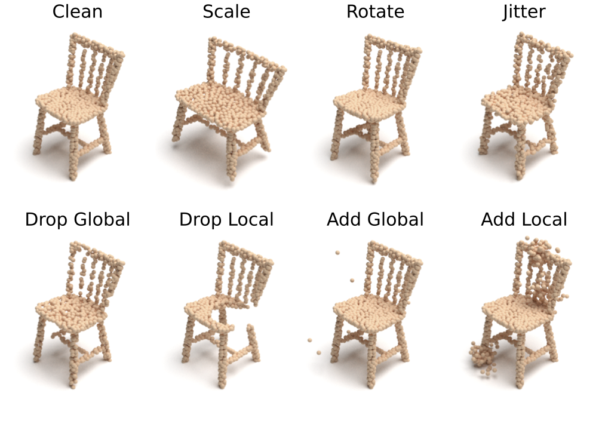

# ModelNet-C (now part of [PointCloud-C](https://github.com/ldkong1205/PointCloud-C))

:warning: This repo has been integrated into our new benchmark [PointCloud-C](https://github.com/ldkong1205/PointCloud-C)! Please checkout [PointCloud-C](https://github.com/ldkong1205/PointCloud-C) for any future updates!

Code for the paper "Benchmarking and Analyzing Point Cloud Classification under Corruptions". For the latest updates, see: [sites.google.com/view/modelnetc/home](https://sites.google.com/view/modelnetc/home)

**[Benchmarking and Analyzing Point Cloud Classification under Corruptions](https://arxiv.org/abs/2202.03377)**  
Jiawei Ren, Liang Pan, Ziwei Liu

arXiv 2022



**ModelNet-C** [[Download Link]](https://drive.google.com/file/d/1KE6MmXMtfu_mgxg4qLPdEwVD5As8B0rm/view?usp=sharing)


## Get Started

### Step 0. Clone the Repo
```shell
git clone https://github.com/jiawei-ren/ModelNet-C.git
cd ModelNet-C
```

### Step 1. Set Up the Environment
Set up the environment by:
```shell
conda create --name modelnetc python=3.7.5
conda activate modelnetc
pip install -r requirements.txt
cd SimpleView/pointnet2_pyt && pip install -e . && cd -
pip install -e modelnetc_utils
```

### Step 2. Prepare Data
Download ModelNet-C by:
```shell
cd data
gdown https://drive.google.com/uc?id=1KE6MmXMtfu_mgxg4qLPdEwVD5As8B0rm
unzip modelnet_c.zip && cd ..
```
Alternatively, you may download [ModelNet40-C](https://drive.google.com/file/d/1KE6MmXMtfu_mgxg4qLPdEwVD5As8B0rm/view?usp=sharing) manually and extract it under `data`.

### Step 3. Download Pretrained Models
Download pretrained models by
```shell
gdown https://drive.google.com/uc?id=11RONLZGg0ezxC16n57PiEZouqC5L0b_h
unzip pretrained_models.zip
```
Alternatively, you may download [pretrained models](https://drive.google.com/file/d/11RONLZGg0ezxC16n57PiEZouqC5L0b_h/view?usp=sharing) manually and extract it under root directory.

## Benchmark on ModelNet-C

### Evaluation Commands
Evaluation commands are provided in [EVALUATE.md](./EVALUATE.md).

### Customize ModelNet-C Evaluation for Your Codebase
We have provided evaluation utilities to help you evaluate on ModelNet-C using your own codebase. 
Please follow [CUSTOMIZE.md](./CUSTOMIZE.md).


### Benchmark Results

| Method          | Reference                                                  | Standalone |  mCE  | Clean OA |
| --------------- | ---------------------------------------------------------- | :--------: | :---: | :------: |
| DGCNN           | [Wang et al.](https://arxiv.org/abs/1801.07829)            |     Yes    | 1.000 |   0.926  |
| PointNet        | [Qi et al.](https://arxiv.org/abs/1612.00593)              |     Yes    | 1.422 |   0.907  |
| PointNet++      | [Qi et al.](https://arxiv.org/abs/1706.02413)              |     Yes    | 1.072 |   0.930  |
| RSCNN           | [Liu et al.](https://arxiv.org/abs/1904.07601)             |     Yes    | 1.130 |   0.923  |
| SimpleView      | [Goyal et al.](https://arxiv.org/abs/2106.05304)           |     Yes    | 1.047 |   0.939  |
| GDANet          | [Xu et al.](https://arxiv.org/abs/2012.10921)              |     Yes    | 0.892 |   0.934  |
| CurveNet        | [Xiang et al.](https://arxiv.org/abs/2105.01288)           |     Yes    | 0.927 |   0.938  |
| PAConv          | [Xu et al.](https://arxiv.org/abs/2103.14635)              |     Yes    | 1.104 |   0.936  |
| PCT             | [Guo et al.](https://arxiv.org/abs/2012.09688)             |     Yes    | 0.925 |   0.930  |
| RPC             | [Ren et al.](https://arxiv.org/abs/2202.03377) |     Yes    | 0.863 |   0.930  |
| DGCNN+PointWOLF | [Kim et al.](https://arxiv.org/abs/2110.05379)             |     No     | 0.814 |   0.926  |
| DGCNN+RSMix     | [Lee et al.](https://arxiv.org/abs/2102.01929)             |     No     | 0.745 |   0.930  |
| DGCNN+WOLFMix   | [Ren et al.](https://arxiv.org/abs/2202.03377) |     No     | 0.590 |   0.932  |
| GDANet+WOLFMix  | [Ren et al.](https://arxiv.org/abs/2202.03377) |     No     | 0.571 |   0.934  |

*Standalone indicates if the method is a standalone architecture or a combination with augmentation or pretrain.

## Todos

- [ ] PointMixup
- [ ] OcCo
- [ ] PointBERT

## Cite ModelNet-C
```bibtex
@article{
    ren2022modelnetc,
    title={Benchmarking and Analyzing Point Cloud Classification under Corruptions},
    author={Jiawei Ren and Liang Pan and Ziwei Liu},
    journal={arXiv:2202.03377},
    year={2022},
}
```


## Acknowledgement
This codebase heavily borrows codes from the following repositories:
- [SimpleView](https://github.com/princeton-vl/SimpleView)
- [PCT_Pytorch](https://github.com/Strawberry-Eat-Mango/PCT_Pytorch)
- [GDANet](https://github.com/mutianxu/GDANet)
- [CurveNet](https://github.com/tiangexiang/CurveNet)
- [PAConv](https://github.com/CVMI-Lab/PAConv)
- [RSMix](https://github.com/dogyoonlee/RSMix)
- [PointWOLF](https://github.com/mlvlab/PointWOLF)
